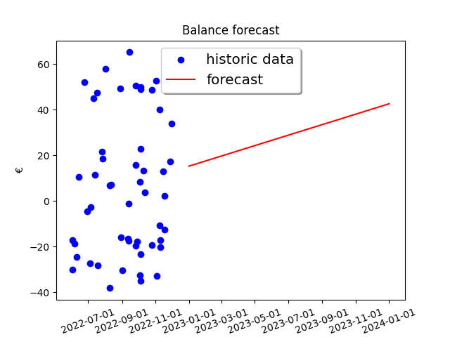

# Introduction
Finance is a tool that helps with the own knowledge of the financial status. It basically tries to discover your account management. To do that two tools are provided:
* Datafeeder: Imports the account balance and movements separately
* Dataprocessor: That process the imported data and generates a forecast based on its past data

The generated plots (forecast and clustering) are saved in the `output` folder. Also, a Jenkinsfile is provided to automatize the data injection
by scanning a folder automatically.

The input data sopported is .xls or .csv files with the format shown in the example


# Requirements
```
apt get install sqlite3 python3
pip install -r requirements.txt
```

# Using the docker
```
git clone https://github.com/diegonieto/finance
docker build - < Dockerfile -t finance
docker run -v `pwd`:/tmp/finance --rm -it finance:latest /bin/bash
```

# Running the example
```
./process-xls.sh example /tmp/miau
python3 datafeeder.py -a /tmp/miau
python3 dataprocessor.py -f "2022-01-01" -t "2022-06-01"
```



# Feeding with your own data
Define a path where the xls are present:

```
export XLS_PATH=<path>
export TMP_PATH=<path>
```

Convert the xls to csv:

`./process-xls.sh $XLS_PATH $TMP_PATH`

Load the csv account data into the database:

`python3 datafeeder.py -a $TMP_PATH`

Load the csv costs data into the database:

`python3 datafeeder.py -c $TMP_PATH`

# Show data processed
Database should be filled before:

`python3 dataprocessor.py`

# SQLite3 read date values
Account:

`select date(datetook), * from account`
Costs:

`select date(date), * from costs`

# Check linear predictor for account

`python3 linearPredictor.py`
